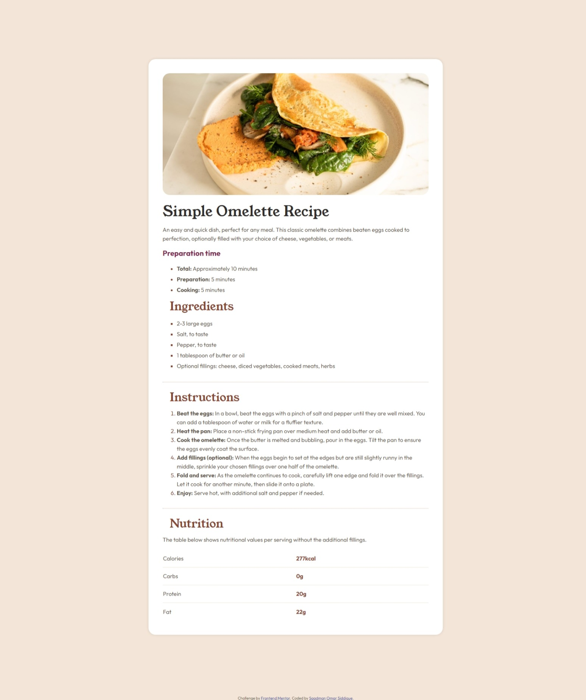

# Frontend Mentor - Recipe page solution

This is a solution to the [Recipe page challenge on Frontend Mentor](https://www.frontendmentor.io/challenges/recipe-page-KiTsR8QQKm). Frontend Mentor challenges help you improve your coding skills by building realistic projects.

## Table of contents

- [Overview](#overview)
  - [The challenge](#the-challenge)
  - [Screenshot](#screenshot)
  - [Links](#links)
- [My process](#my-process)
  - [Built with](#built-with)
  - [What I learned](#what-i-learned)
  - [Continued development](#continued-development)
  - [Useful resources](#useful-resources)
- [Author](#author)
- [Acknowledgments](#acknowledgments)

**Note: Delete this note and update the table of contents based on what sections you keep.**

## Overview

### Screenshot



### Links

- Solution URL: [Github](https://github.com/Jumping-Saadman/recipe-page-main)
- Live Site URL: [Github.io](https://jumping-saadman.github.io/recipe-page-main/)

## My process

### Built with

- Semantic HTML5 markup
- CSS

### What I learned

1. hr tag

```html
<hr />
```

2. how to use local fonts in CSS.

```css
@font-face {
  font-family: "Young Serif";
  src: url("/assets/fonts/young-serif/YoungSerif-Regular.ttf");
}
```

3. How to make a table outer border disappear

```css
.border-none {
  border-collapse: collapse;
  border: none;
}

.border-none td {
  border: 1px solid hsl(30, 54%, 90%);
  width: 500px;
}

.border-none tr:first-child td {
  border-top: none;
}

.border-none tr:last-child td {
  border-bottom: none;
}

.border-none tr td:first-child {
  border-left: none;
  border-right: none;
}

.border-none tr td:last-child {
  border-right: none;
  border-left: none;
}

.border-none td:last-child {
  color: hsl(14, 45%, 36%);
  font-weight: 700;
}
```

4. how to make ordered index bold

```css
ol > li::marker {
  font-weight: 700;
}
```

5. how to change table row height

```css
table,
tr {
  height: 50px;
}
```

6. Pseudo-elements

```css
li::marker {
  color: hsl(14, 45%, 36%);
}
```

### Continued development

I want to further work with pseudo-elements.

### Useful resources

- [W3 Schools](https://www.w3schools.com/css/default.asp) - This helped me learn about different html tags and css properties. I like their straight forward approach to providing information.
- [Stack Overflow](https://stackoverflow.com/) - QA website used by professionals where I found solutions to several of my problems. It is great because every QA thread is well maintained and many developer support is available there.

## Author

- Website - [Saadman Omar Siddique](https://www.linkedin.com/in/saadman-omar-0bb700208/)
- Frontend Mentor - [@Jumping-Saadman](https://www.frontendmentor.io/profile/Jumping-Saadman)
- Twitter - [@SaadmanOmar](https://x.com/SaadmanOmar)
- Youtube - [@saadmanomarsiddique](https://www.youtube.com/@saadmanomarsiddique)

## Acknowledgments

I got great help from this Stackoverflow thread - [Removing outer border in html table](https://stackoverflow.com/questions/35571603/removing-outer-border-in-html-table) that gave me the exact solution I needed for one of the problems in the challenge. Great thanks to this QA thread for being so helpful.
